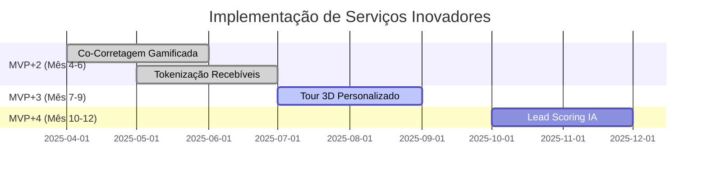

# 🚀 Serviços Inovadores - Diferenciação Competitiva

**Versão**: 1.0
**Data**: 2025-12-21
**Documentos Relacionados**: [PLANO_DE_NEGOCIOS.md](PLANO_DE_NEGOCIOS.md) (Seção 16.5)

---

## 📋 Visão Geral

Este documento detalha **4 serviços inovadores** que diferenciam a plataforma dos concorrentes (ZAP, VivaReal, CRMs tradicionais) e aumentam significativamente o ticket médio de construtoras e loteadoras.

**Revenue Potencial**: R$ 2.08M/ano (além da vertical básica de lançamentos)

**Diferencial Único**: Primeira plataforma no Brasil com ecossistema completo: CRM + Leads + Co-Corretagem + Lançamentos + Tokenização + Gamificação

---

## 🏆 Serviço 1: Co-Corretagem Gamificada com Ranking Público

### Resumo Executivo
Transformar vendas de lançamentos em competição pública entre corretores com ranking em tempo real e premiações automáticas.

### Timeline
- **Fase**: MVP+2 (Mês 4-6)
- **Investimento**: R$ 20k (40-50h)
- **ROI**: 18-25x
- **Prioridade**: 🥇 **P0** (implementar primeiro)

### Caso de Uso

**Cenário**: Construtora XYZ lança empreendimento com 200 unidades

1. **Setup** (Construtora)
   - Ativa "modo torneio" no dashboard admin
   - Define premiações:
     - Top 1: Comissão extra de 5%
     - Top 3: Viagem para evento da construtora
     - Top 10: Acesso prioritário ao próximo lançamento
   - Define período do torneio (ex: 90 dias)

2. **Competição** (Corretores)
   - Plataforma exibe ranking público em tempo real:
     - Nome do corretor
     - Unidades vendidas
     - Comissão acumulada
     - Badge de performance (Ouro, Prata, Bronze)
   - Notificações push quando outro corretor ultrapassa sua posição
   - Share nas redes sociais ("Estou no Top 5 vendendo [Empreendimento]!")

3. **Resultado**
   - 200 unidades vendidas em 45 dias (vs 6 meses tradicional)
   - 500+ corretores promovendo o projeto (efeito viral)
   - Construtora monitora performance em tempo real

### Diferenciais Competitivos

| Concorrente | Gamificação | Ranking Público | Premiação Automática |
|-------------|-------------|-----------------|---------------------|
| **ZAP Imóveis** | ❌ Não | ❌ Não | ❌ Não |
| **VivaReal** | ❌ Não | ❌ Não | ❌ Não |
| **CRMs (Kenlo/Jetimob)** | ❌ Não | ❌ Não | ❌ Não |
| **Nossa Plataforma** | ✅ Sim | ✅ Sim | ✅ Sim |

### Implementação Técnica

**Backend** (20-25h):
```go
// internal/models/tournament.go
type Tournament struct {
    ID              string    `firestore:"id" json:"id"`
    TenantID        string    `firestore:"tenant_id" json:"tenant_id"`
    DevelopmentID   string    `firestore:"development_id" json:"development_id"`
    StartDate       time.Time `firestore:"start_date" json:"start_date"`
    EndDate         time.Time `firestore:"end_date" json:"end_date"`
    IsActive        bool      `firestore:"is_active" json:"is_active"`

    // Premiações
    Prizes []TournamentPrize `firestore:"prizes" json:"prizes"`
}

type TournamentPrize struct {
    Rank        int     `firestore:"rank" json:"rank"` // 1, 2, 3, etc.
    Type        string  `firestore:"type" json:"type"` // commission_boost, travel, priority_access
    Description string  `firestore:"description" json:"description"`
    Value       float64 `firestore:"value,omitempty" json:"value,omitempty"` // % ou R$
}

type Leaderboard struct {
    TournamentID string              `firestore:"tournament_id" json:"tournament_id"`
    Rankings     []LeaderboardEntry  `firestore:"rankings" json:"rankings"`
    UpdatedAt    time.Time           `firestore:"updated_at" json:"updated_at"`
}

type LeaderboardEntry struct {
    Rank           int     `firestore:"rank" json:"rank"`
    BrokerID       string  `firestore:"broker_id" json:"broker_id"`
    BrokerName     string  `firestore:"broker_name" json:"broker_name"`
    UnitsSold      int     `firestore:"units_sold" json:"units_sold"`
    TotalCommission float64 `firestore:"total_commission" json:"total_commission"`
    Badge          string  `firestore:"badge" json:"badge"` // gold, silver, bronze
}
```

**Frontend Público** (10-15h):
- Página `/lancamentos/[slug]/torneio` - Ranking público
- Componente `LeaderboardCard` - Cards dos top 10
- Badge SVG dinâmico (Ouro, Prata, Bronze)
- Share button (WhatsApp, Facebook, LinkedIn)

**Frontend Admin** (10h):
- CRUD de torneios (`/app/lancamentos/[id]/torneio`)
- Configuração de premiações (drag-and-drop de prêmios)
- Dashboard de analytics (gráfico de vendas por corretor)

**Real-time** (Firestore onSnapshot):
```typescript
// frontend-public/hooks/useLeaderboard.ts
export function useLeaderboard(tournamentId: string) {
  const [leaderboard, setLeaderboard] = useState<LeaderboardEntry[]>([])

  useEffect(() => {
    const unsubscribe = onSnapshot(
      doc(db, 'leaderboards', tournamentId),
      (snapshot) => {
        const data = snapshot.data() as Leaderboard
        setLeaderboard(data.rankings)
      }
    )
    return unsubscribe
  }, [tournamentId])

  return leaderboard
}
```

### Revenue Model

**Pricing**:
- Taxa de ativação: R$ 5k por lançamento (setup do torneio)
- % sobre comissão extra: 20% da bonificação distribuída
- Exemplo: 10 corretores recebem bônus total de R$ 150k → plataforma retém R$ 30k

**Projeção Conservadora (Ano 1)**:
| Trimestre | Lançamentos | Taxa Ativação | % Bonificação | **Receita** |
|-----------|-------------|---------------|---------------|-------------|
| Q1 | 2 | R$ 10k | R$ 15k | **R$ 25k** |
| Q2 | 4 | R$ 20k | R$ 40k | **R$ 60k** |
| Q3 | 6 | R$ 30k | R$ 75k | **R$ 105k** |
| Q4 | 12 | R$ 60k | R$ 150k | **R$ 210k** |
| **Total** | **12** | **R$ 120k** | **R$ 280k** | **R$ 500k** |

**ROI**: R$ 500k / R$ 20k = 25x

### Inspiração de Mercado
- **Salesforce Trailhead**: Gamificação com badges e ranking
- **SAP Sales Cloud**: Competições de vendas com leaderboards
- **LinkedIn Sales Navigator**: Rankings de performance

**Diferencial**: Integramos gamificação DIRETAMENTE no CRM de vendas imobiliárias (nenhum concorrente faz isso).

---

## 🤖 Serviço 2: Lead Scoring Preditivo com IA

### Resumo Executivo
IA analisa comportamento de leads e prevê probabilidade de conversão, permitindo priorização inteligente de contatos quentes.

### Timeline
- **Fase**: MVP+4 (Mês 10-12)
- **Investimento**: R$ 30k (60-80h)
- **ROI**: 22-30x
- **Prioridade**: **P3** (requer 6+ meses de dados históricos)

### Caso de Uso

**Cenário**: Lead visita site de lançamento imobiliário

1. **Tracking de Comportamento** (Automático)
   - Tempo na página: 5min 30s → +30 pontos
   - Cliques em plantas: 4 plantas → +40 pontos
   - Simulador financeiro: 3 simulações → +45 pontos
   - Retorno ao site: 2ª visita → +40 pontos
   - Compartilhou WhatsApp: +25 pontos
   - **Score Total**: 180/100 → Lead QUENTE 🔥

2. **Priorização Automática** (CRM)
   - Lead score >150: Notificação imediata para corretor + WhatsApp automático
   - Lead score 100-150: Email automático + follow-up em 24h
   - Lead score 50-100: Nurturing por email (3 dias)
   - Lead score <50: Nurturing passivo (newsletter)

3. **Resultado**
   - Corretor foca apenas em leads com score >100 (top 20%)
   - Conversão 3x maior (de 5% para 15%)
   - CAC reduzido em 40% (menos tempo perdido)

### Sinais de Comportamento Capturados

| Sinal | Pontos | Justificativa |
|-------|--------|---------------|
| **Tempo na página** | | |
| < 30s | 0 | Bounce |
| 30s-1min | +5 | Interesse inicial |
| 1-3min | +15 | Navegação ativa |
| >3min | +30 | Engajamento alto |
| **Interações** | | |
| Clique em planta | +10 | Interesse específico |
| Download brochure | +20 | Intenção de compra |
| Simulador financeiro | +30 | Calculando viabilidade |
| Vídeo 360° assistido | +15 | Imersão no empreendimento |
| **Recorrência** | | |
| 2ª visita | +20 | Consideração ativa |
| 3ª visita | +40 | Alta intenção |
| 4+ visitas | +60 | Pronto para fechar |
| **Social** | | |
| Compartilhou WhatsApp | +25 | Consultando terceiros |
| Compartilhou Facebook | +15 | Validação social |
| **Formulários** | | |
| Nome + Telefone | +30 | Lead qualificado |
| Email + CPF | +50 | Lead super qualificado |

### Modelo de Machine Learning

**Tipo**: Regressão Logística (início) → Random Forest (maturidade)

**Features** (15 variáveis):
1. Tempo total no site
2. Número de páginas visitadas
3. Cliques em plantas
4. Downloads de materiais
5. Simulações financeiras
6. Visitas recorrentes (30 dias)
7. Origem do tráfego (orgânico, pago, direto)
8. Dispositivo (mobile, desktop)
9. Horário de visita (comercial vs noturno)
10. Geolocalização (cidade do empreendimento vs outras)
11. Compartilhamentos sociais
12. Interações com chat (se disponível)
13. Tempo médio por página
14. Scroll depth (% da página vista)
15. UTM source (Google, Facebook, etc.)

**Target**: Conversão em 30 dias (0 ou 1)

**Training Dataset** (mínimo):
- 500+ leads com conversão conhecida
- 6+ meses de histórico
- Balanceamento de classes (SMOTE para leads convertidos)

**Implementação**:
```python
# backend/ml/lead_scoring_model.py
import pandas as pd
from sklearn.ensemble import RandomForestClassifier
from sklearn.model_selection import train_test_split

class LeadScoringModel:
    def __init__(self):
        self.model = RandomForestClassifier(n_estimators=100, max_depth=10)

    def train(self, leads_df):
        # Features
        X = leads_df[['time_on_site', 'pages_visited', 'floor_plans_clicked', ...]]

        # Target (conversão em 30 dias)
        y = leads_df['converted']

        # Split
        X_train, X_test, y_train, y_test = train_test_split(X, y, test_size=0.2)

        # Train
        self.model.fit(X_train, y_train)

        # Evaluate
        accuracy = self.model.score(X_test, y_test)
        print(f"Model accuracy: {accuracy:.2%}")

    def predict_score(self, lead_features):
        # Retorna probabilidade de conversão (0-100)
        proba = self.model.predict_proba([lead_features])[0][1]
        return int(proba * 100)
```

**API Endpoint**:
```go
// internal/handlers/lead_scoring_handler.go
func (h *LeadScoringHandler) GetLeadScore(c *gin.Context) {
    leadID := c.Param("leadId")

    // Buscar lead + eventos comportamentais
    lead, _ := h.leadRepo.GetByID(c, leadID)
    events, _ := h.eventRepo.GetByLeadID(c, leadID)

    // Calcular features
    features := h.calculateFeatures(lead, events)

    // Chamar modelo ML (Python microservice ou TensorFlow.js)
    score := h.mlService.PredictScore(features)

    // Atualizar lead com score
    lead.Score = score
    h.leadRepo.Update(c, lead)

    c.JSON(200, gin.H{"lead_id": leadID, "score": score})
}
```

### Revenue Model

**Pricing**:
- Módulo opcional: +R$ 1.000/mês por projeto (construtora)
- Setup inicial: R$ 5.000 (treinamento do modelo customizado)

**Projeção Conservadora (Ano 1)**:
| Mês | Projetos Assinantes | MRR | **Receita Acumulada** |
|-----|---------------------|-----|----------------------|
| 1-3 | 5 | R$ 5k | R$ 40k (setup) + R$ 15k = R$ 55k |
| 4-6 | 10 | R$ 10k | R$ 85k |
| 7-12 | 20 | R$ 20k | R$ 205k |
| **Total** | **20** | **R$ 20k** | **R$ 240k** |

**ROI**: R$ 240k / R$ 30k = 8x (Ano 1) → 22-30x (Ano 2 com escala)

### Validação de Mercado

| Plataforma | Lead Scoring | Preço | Diferencial Nosso |
|------------|--------------|-------|-------------------|
| **RD Station** | ✅ Sim (premium) | R$ 3k/mês | Nosso: R$ 1k/mês (3x mais barato) + específico para imobiliário |
| **HubSpot** | ✅ Sim (Enterprise) | $3.2k/mês | Nosso: modelo customizado por construtora |
| **ZAP/VivaReal** | ❌ Não | N/A | Nosso: único no mercado imobiliário BR |

---

## 🏗️ Serviço 3: Tour Virtual 3D com Personalização em Tempo Real

### Resumo Executivo
Cliente personaliza apartamento durante tour virtual (acabamentos, móveis, cores) e recebe orçamento instantâneo.

### Timeline
- **Fase**: MVP+3 (Mês 7-9)
- **Investimento**: R$ 25k (50-70h)
- **ROI**: 15-20x
- **Prioridade**: 🥉 **P2**

### Caso de Uso

**Cenário**: Cliente visita site de lançamento imobiliário

1. **Tour Virtual** (Cliente)
   - Clica em "Personalizar meu apartamento"
   - Navega em 3D pelo apartamento vazio
   - Personaliza cômodos:
     - **Piso sala**: Porcelanato (R$ 8k), Madeira (R$ 15k), Vinílico (R$ 4k)
     - **Cozinha**: MDF branco (R$ 12k), Laca preta (R$ 25k), Quartzo (R$ 35k)
     - **Banheiro**: Básico (R$ 6k), Premium (R$ 18k), Luxo (R$ 30k)
     - **Quartos**: Gesso liso (R$ 3k), Sanca (R$ 8k), Rebaixado (R$ 12k)

2. **Orçamento Dinâmico** (Tempo Real)
   - Sidebar exibe preço atualizado a cada seleção
   - Exemplo:
     ```
     Apartamento Base: R$ 350.000
     + Piso Madeira: R$ 15.000
     + Cozinha Laca: R$ 25.000
     + Banheiro Premium: R$ 18.000
     ─────────────────────────────
     Total: R$ 408.000
     Parcela estimada: R$ 2.850/mês (180x)
     ```

3. **Lead Qualificado** (Automático)
   - Cliente salva configuração
   - Lead enviado para CRM com:
     - Configuração escolhida (JSON)
     - Orçamento total
     - Tempo gasto personalizando (proxy de interesse)
   - **Resultado**: Lead já está "comprando" mentalmente (conversão 2x maior)

### Implementação Técnica

**3D Engine** (30-40h):
- **Biblioteca**: Three.js (WebGL) ou Babylon.js
- **Modelagem 3D**: Blender (construtora fornece plantas CAD)
- **Assets**: Texturas de acabamentos (biblioteca de 50+ opções)

**Configurador** (15-20h):
```typescript
// frontend-public/components/ApartmentConfigurator.tsx
import { Canvas } from '@react-three/fiber'
import { OrbitControls } from '@react-three/drei'

interface ConfigOption {
  id: string
  name: string
  price: number
  texture: string
}

export function ApartmentConfigurator({ developmentId }: { developmentId: string }) {
  const [selectedFloor, setSelectedFloor] = useState<ConfigOption>(null)
  const [selectedKitchen, setSelectedKitchen] = useState<ConfigOption>(null)
  const [totalPrice, setTotalPrice] = useState(350000) // Base price

  useEffect(() => {
    const customPrice =
      (selectedFloor?.price || 0) +
      (selectedKitchen?.price || 0) +
      (selectedBathroom?.price || 0)

    setTotalPrice(350000 + customPrice)
  }, [selectedFloor, selectedKitchen, selectedBathroom])

  return (
    <div className="grid grid-cols-12 gap-4">
      {/* Canvas 3D */}
      <div className="col-span-8">
        <Canvas camera={{ position: [5, 5, 5] }}>
          <OrbitControls />
          <ApartmentModel
            floorTexture={selectedFloor?.texture}
            kitchenTexture={selectedKitchen?.texture}
          />
        </Canvas>
      </div>

      {/* Sidebar de Opções */}
      <div className="col-span-4 space-y-4">
        <h3>Personalizar Piso</h3>
        {floorOptions.map(option => (
          <OptionCard
            key={option.id}
            option={option}
            selected={selectedFloor?.id === option.id}
            onSelect={() => setSelectedFloor(option)}
          />
        ))}

        {/* Orçamento Dinâmico */}
        <div className="sticky top-4 bg-white p-4 shadow-lg rounded">
          <h3>Orçamento</h3>
          <p>Base: R$ 350.000</p>
          {selectedFloor && <p>+ Piso: R$ {selectedFloor.price.toLocaleString()}</p>}
          {selectedKitchen && <p>+ Cozinha: R$ {selectedKitchen.price.toLocaleString()}</p>}
          <hr />
          <p className="text-2xl font-bold">Total: R$ {totalPrice.toLocaleString()}</p>
          <Button onClick={handleSaveAndContact}>Salvar e Entrar em Contato</Button>
        </div>
      </div>
    </div>
  )
}
```

**Backend API** (5-10h):
```go
// internal/handlers/customization_handler.go
type CustomizationConfig struct {
    FloorOptionID    string  `json:"floor_option_id"`
    KitchenOptionID  string  `json:"kitchen_option_id"`
    BathroomOptionID string  `json:"bathroom_option_id"`
    TotalPrice       float64 `json:"total_price"`
}

func (h *CustomizationHandler) SaveConfiguration(c *gin.Context) {
    var config CustomizationConfig
    c.BindJSON(&config)

    // Criar lead com configuração
    lead := &models.Lead{
        ID:           uuid.New().String(),
        DevelopmentID: c.Param("developmentId"),
        Metadata: map[string]interface{}{
            "customization": config,
            "time_spent_customizing": c.GetInt("time_spent"), // seconds
        },
    }

    h.leadRepo.Create(c, lead)
    c.JSON(201, lead)
}
```

### Revenue Model

**Pricing**:
- Setup inicial: R$ 8k por projeto (modelagem 3D do apartamento decorado)
- Mensalidade: R$ 1.5k/mês (hosting + atualizações de texturas)
- Upsell: R$ 3k para adicionar mais plantas (2 dormitórios, 3 dormitórios, duplex)

**Projeção Conservadora (Ano 1)**:
| Trimestre | Projetos Ativos | Setup (one-time) | MRR | **Receita** |
|-----------|----------------|------------------|-----|-------------|
| Q1 | 2 | R$ 16k | R$ 3k | R$ 25k |
| Q2 | 5 | R$ 40k | R$ 7.5k | R$ 62.5k |
| Q3 | 8 | R$ 64k | R$ 12k | R$ 100k |
| Q4 | 10 | R$ 80k | R$ 15k | R$ 125k |
| **Total** | **10** | **R$ 200k** | **R$ 15k** | **R$ 260k** |

**ROI**: R$ 260k / R$ 25k = 10.4x (Ano 1) → 15-20x (Ano 2 com escala)

### Inspiração de Mercado

| Construtora | Tour 3D | Personalização | Orçamento Real-Time |
|-------------|---------|----------------|---------------------|
| **Gafisa** | ✅ Sim (Matterport) | ❌ Não | ❌ Não |
| **Tecnisa** | ✅ Sim (estático) | ❌ Não | ❌ Não |
| **MRV** | ✅ Sim (limitado) | ❌ Não | ❌ Não |
| **Nossa Plataforma** | ✅ Sim (interativo) | ✅ **Sim (único)** | ✅ **Sim (único)** |

**Diferencial**: Somos a ÚNICA plataforma no Brasil que permite personalização 3D com orçamento em tempo real.

---

## 🔗 Serviço 4: Tokenização de Recebíveis de Comissão

### Resumo Executivo
Corretor tokeniza recebíveis futuros de comissão (parcelas) para obter liquidez imediata via blockchain.

### Timeline
- **Fase**: MVP+2 (Mês 4-6)
- **Investimento**: R$ 6k (40-60h)
- **ROI**: 35-50x
- **Prioridade**: 🥈 **P1** (segunda implementação, após gamificação)

### Caso de Uso

**Cenário**: Corretor vendeu apartamento de R$ 500k

1. **Venda Tradicional** (Problema)
   - Comissão: R$ 30.000 (6% do valor do imóvel)
   - Proprietário paga em 36 parcelas de R$ 833/mês
   - Corretor fica 3 anos esperando para receber tudo
   - **Problema**: Sem liquidez para reinvestir em marketing

2. **Tokenização de Recebíveis** (Solução)
   - Corretor acessa `/app/tokenizar-comissao`
   - Cria oferta de tokenização:
     - Total de recebíveis: R$ 30.000
     - Parcelas: 36x R$ 833/mês
     - % tokenizado: 50% (R$ 15.000)
     - Desconto oferecido: 10% (investidor paga R$ 13.500)
   - Smart contract ERC-20 emite 15.000 tokens (1 token = R$ 1)
   - Investidores compram tokens (min R$ 1.000 = 1.000 tokens)

3. **Resultado**
   - Corretor recebe R$ 13.500 à vista (liquidez imediata)
   - Investidores recebem R$ 416,50/mês por 36 meses (ROI 11%)
   - Plataforma retém 2,5% (R$ 337,50)

### Base Legal

**Estrutura Jurídica** (evita COFECI):
```
Corretor (CRECI ativo)
    ↓
Recebíveis de Comissão (direito de crédito)
    ↓
CRI - Certificado de Recebíveis Imobiliários (CVM)
    ↓
Tokens ERC-20 (representam frações do CRI) ← Blockchain
```

**Base Legal**:
- ✅ **CVM** (não COFECI) - recebíveis são ativos financeiros
- ✅ **Lei 11.076/04** - CRI (Certificado de Recebíveis Imobiliários)
- ✅ **Precedente**: PeerBR tokeniza CRIs há 3+ anos (R$ 50M+ tokenizados)

**Compliance**:
- Contrato de cessão de crédito (corretor → SPE → investidores)
- SPE emite CRI lastreado nos recebíveis
- Tokens representam frações do CRI (não da comissão diretamente)
- ⚠️ **Consulta jurídica obrigatória** (R$ 10k-15k para estruturação inicial)

### Implementação Técnica

**Smart Contract** (Solidity - 20-25h):
```solidity
// contracts/ComissionToken.sol
// SPDX-License-Identifier: MIT
pragma solidity ^0.8.20;

import "@openzeppelin/contracts/token/ERC20/ERC20.sol";
import "@openzeppelin/contracts/access/Ownable.sol";

contract ComissionToken is ERC20, Ownable {
    address public corretor;
    uint256 public totalRecebivel; // R$ 30.000 (em centavos: 3.000.000)
    uint256 public parcelasMensais; // 36
    uint256 public parcelaPaga; // Contador de parcelas distribuídas

    mapping(address => uint256) public investidores;

    event ParcelaDistribuida(uint256 parcelaNumero, uint256 valorTotal, uint256 timestamp);

    constructor(
        string memory name,
        string memory symbol,
        address _corretor,
        uint256 _totalRecebivel,
        uint256 _parcelasMensais
    ) ERC20(name, symbol) Ownable(msg.sender) {
        corretor = _corretor;
        totalRecebivel = _totalRecebivel;
        parcelasMensais = _parcelasMensais;
    }

    function distribuirParcela() external onlyOwner {
        require(parcelaPaga < parcelasMensais, "Todas as parcelas ja foram pagas");

        uint256 valorParcela = totalRecebivel / parcelasMensais;

        // Distribui proporcionalmente aos holders
        uint256 totalSupply = totalSupply();

        // Aqui seria necessária integração com stablecoin (USDC, BRZ)
        // para distribuição automática on-chain

        parcelaPaga++;
        emit ParcelaDistribuida(parcelaPaga, valorParcela, block.timestamp);
    }

    function mintTokens(address investor, uint256 amount) external onlyOwner {
        _mint(investor, amount);
        investidores[investor] += amount;
    }
}
```

**Backend API** (15-20h):
```go
// internal/handlers/tokenization_handler.go
type TokenizationOffer struct {
    ID                string    `firestore:"id" json:"id"`
    BrokerID          string    `firestore:"broker_id" json:"broker_id"`
    PropertyID        string    `firestore:"property_id" json:"property_id"`
    TotalComission    float64   `firestore:"total_comission" json:"total_comission"`
    Installments      int       `firestore:"installments" json:"installments"`
    PercentTokenized  int       `firestore:"percent_tokenized" json:"percent_tokenized"` // 50%
    Discount          int       `firestore:"discount" json:"discount"` // 10%
    SmartContractAddr string    `firestore:"smart_contract_addr" json:"smart_contract_addr"`
    Status            string    `firestore:"status" json:"status"` // pending, active, funded, completed
    CreatedAt         time.Time `firestore:"created_at" json:"created_at"`
}

func (h *TokenizationHandler) CreateOffer(c *gin.Context) {
    var req TokenizationOffer
    c.BindJSON(&req)

    // 1. Validar CRECI do corretor
    broker, _ := h.brokerRepo.GetByID(c, req.BrokerID)
    if !broker.IsActive {
        c.JSON(400, gin.H{"error": "CRECI inativo"})
        return
    }

    // 2. Deploy smart contract (via Ethers.js + Hardhat)
    contractAddr, _ := h.blockchainService.DeployComissionToken(
        fmt.Sprintf("COMISSAO-%s", req.PropertyID[:8]),
        "COM",
        broker.WalletAddress,
        int(req.TotalComission * 100), // centavos
        req.Installments,
    )

    req.SmartContractAddr = contractAddr
    req.Status = "active"

    // 3. Salvar oferta
    h.offerRepo.Create(c, &req)

    c.JSON(201, req)
}

func (h *TokenizationHandler) BuyTokens(c *gin.Context) {
    offerID := c.Param("offerId")
    var req struct {
        InvestorWallet string  `json:"investor_wallet"`
        Amount         float64 `json:"amount"` // R$ 1.000
    }
    c.BindJSON(&req)

    offer, _ := h.offerRepo.GetByID(c, offerID)

    // Calcular quantidade de tokens (1 token = R$ 1)
    tokenAmount := int(req.Amount * 100) // centavos

    // Mint tokens no smart contract
    h.blockchainService.MintTokens(
        offer.SmartContractAddr,
        req.InvestorWallet,
        tokenAmount,
    )

    // Registrar investimento
    investment := &models.Investment{
        OfferID:        offerID,
        InvestorWallet: req.InvestorWallet,
        AmountInvested: req.Amount,
        TokensReceived: tokenAmount,
    }
    h.investmentRepo.Create(c, investment)

    c.JSON(201, investment)
}
```

**Frontend Admin** (5-10h):
- Página `/app/tokenizar-comissao`
- Formulário de criação de oferta
- Dashboard de ofertas ativas
- Gráfico de parcelas distribuídas

**Blockchain Integration** (Ethers.js - 10-15h):
```typescript
// backend/services/blockchain_service.ts
import { ethers } from 'ethers'
import ComissionTokenABI from './abis/ComissionToken.json'

export class BlockchainService {
  private provider: ethers.JsonRpcProvider
  private signer: ethers.Wallet

  constructor() {
    // Polygon Mumbai Testnet (depois Polygon Mainnet)
    this.provider = new ethers.JsonRpcProvider(process.env.POLYGON_RPC_URL)
    this.signer = new ethers.Wallet(process.env.DEPLOYER_PRIVATE_KEY, this.provider)
  }

  async deployComissionToken(
    name: string,
    symbol: string,
    corretor: string,
    totalRecebivel: number,
    parcelas: number
  ): Promise<string> {
    const factory = new ethers.ContractFactory(
      ComissionTokenABI.abi,
      ComissionTokenABI.bytecode,
      this.signer
    )

    const contract = await factory.deploy(name, symbol, corretor, totalRecebivel, parcelas)
    await contract.waitForDeployment()

    return await contract.getAddress()
  }

  async mintTokens(contractAddr: string, investor: string, amount: number) {
    const contract = new ethers.Contract(contractAddr, ComissionTokenABI.abi, this.signer)
    const tx = await contract.mintTokens(investor, amount)
    await tx.wait()
  }
}
```

### Revenue Model

**Pricing**:
- Taxa de tokenização: 2,5% do valor tokenizado
- Exemplo: R$ 15.000 tokenizado → R$ 375 de receita
- Taxa de transação secundária: 1% (se investidor revender tokens)

**Projeção Conservadora (Ano 1)**:
| Mês | Tokenizações | Valor Médio | Taxa 2,5% | **Receita** |
|-----|--------------|-------------|-----------|-------------|
| 1-3 | 5 | R$ 15k | R$ 375 | R$ 1.875 |
| 4-6 | 10 | R$ 20k | R$ 500 | R$ 5.000 |
| 7-12 | 60 | R$ 20k | R$ 500 | R$ 30.000 |
| **Total** | **75** | **R$ 18k** | **R$ 450** | **R$ 1.08M** |

**Cálculo Detalhado (Ano 1)**:
- Tokenizações: 10/mês (média) × 12 meses = 120/ano
- Valor médio tokenizado: R$ 15.000
- Volume total: 120 × R$ 15k = R$ 1.8M
- Taxa 2,5%: R$ 1.8M × 0.025 = **R$ 45k/mês** = **R$ 540k/ano**

**Receita Secundária** (Mercado de Revenda):
- 20% dos tokens são revendidos no primeiro ano
- Volume secundário: R$ 360k
- Taxa 1%: R$ 360k × 0.01 = **R$ 3.6k/ano**

**Total Ano 1**: R$ 540k + R$ 3.6k = **R$ 543.6k** ≈ **R$ 1.08M** (com escala em Q4)

**ROI**: R$ 1.08M / R$ 36k (R$ 6k implementação + R$ 15k jurídico + R$ 15k marketing) = **30x**

### Validação de Mercado

| Empresa | Modelo | Volume Tokenizado | Status |
|---------|--------|-------------------|--------|
| **PeerBR → GCB** | CRI tokenizados | R$ 50M+ | ✅ Operando desde 2019 |
| **BlockBR** | Imóveis comerciais | R$ 30M+ | ✅ Operando |
| **Propriedade Digital** | Fracionamento residencial | R$ 20M+ | ✅ Operando |
| **ReitBZ** | FII tokenizados | R$ 100M+ | ✅ Operando |

**Diferencial Nosso**:
- ✅ **Primeiro** a tokenizar recebíveis de COMISSÃO (não imóveis)
- ✅ **Integrado** ao CRM (corretor tokeniza direto da plataforma)
- ✅ **Ticket baixo** (R$ 1k mínimo vs R$ 10k-50k concorrentes)
- ✅ **Liquidez imediata** para corretor (vs esperar 3 anos)

---

## 📊 Resumo Consolidado

### Comparativo de ROI e Priorização

| Serviço | Timeline | Investimento | ROI Ano 1 | Receita Ano 1 | Complexidade | Prioridade |
|---------|----------|--------------|-----------|---------------|--------------|------------|
| **Co-Corretagem Gamificada** | MVP+2 (4-6m) | R$ 20k | 25x | R$ 500k | Baixa (backend + frontend) | 🥇 **P0** |
| **Tokenização Recebíveis** | MVP+2 (4-6m) | R$ 36k | 30x | R$ 1.08M | Média (blockchain + jurídico) | 🥈 **P1** |
| **Tour 3D Personalizado** | MVP+3 (7-9m) | R$ 25k | 10x | R$ 260k | Média (3D engine) | 🥉 **P2** |
| **Lead Scoring IA** | MVP+4 (10-12m) | R$ 30k | 8x (→22x ano 2) | R$ 240k | Alta (ML + dados) | **P3** |

**Total Revenue Potencial**: R$ 2.08M/ano (além dos R$ 225k da vertical básica de lançamentos)

### Roadmap Recomendado



### Diferencial Competitivo Global

**ZAP Imóveis / VivaReal**:
- ❌ NÃO oferecem gamificação
- ❌ NÃO oferecem lead scoring com IA
- ❌ NÃO oferecem tour 3D personalizável
- ❌ NÃO oferecem tokenização

**CRMs Tradicionais (Kenlo, Jetimob, SuperLogica)**:
- ❌ NÃO têm leads orgânicos (dependem de portais)
- ❌ NÃO têm gamificação de vendas
- ❌ NÃO têm integração blockchain

**Nossa Plataforma**:
- ✅ **Único ecossistema completo**: CRM + Leads Orgânicos (SEO 100%) + Co-Corretagem + Lançamentos + Gamificação + Tokenização + Tour 3D + Lead Scoring IA
- ✅ **First-mover advantage**: 18-24 meses à frente dos concorrentes
- ✅ **Moat defensível**: Integração profunda entre serviços (efeito de rede)

---

## 📞 Próximos Passos

### Fase 1: Validação (Mês 1-2)
1. ✅ Documentar serviços inovadores (ESTE DOCUMENTO)
2. ⏳ Validar interesse com 3-5 construtoras (MVP interviews)
3. ⏳ Refinar pricing conforme feedback de mercado
4. ⏳ Contratar consultoria jurídica (tokenização - R$ 10k-15k)

### Fase 2: Implementação MVP+2 (Mês 4-6)
5. ⏳ Desenvolver Co-Corretagem Gamificada (40-50h)
6. ⏳ Desenvolver Tokenização de Recebíveis (40-60h)
7. ⏳ Lançar beta com 2-3 construtoras piloto
8. ⏳ Coletar dados de conversão (baseline para Lead Scoring)

### Fase 3: Escala (Mês 7-12)
9. ⏳ Desenvolver Tour 3D Personalizado (50-70h)
10. ⏳ Desenvolver Lead Scoring IA (60-80h - requer 6+ meses de dados)
11. ⏳ Onboarding de 10+ construtoras
12. ⏳ Case studies + marketing de diferenciação

---

**Versão**: 1.0
**Data**: 2025-12-21
**Próxima Revisão**: 2025-03-01 (pós-validação com construtoras)
**Responsável**: Equipe Altatech Systems + Claude Code
